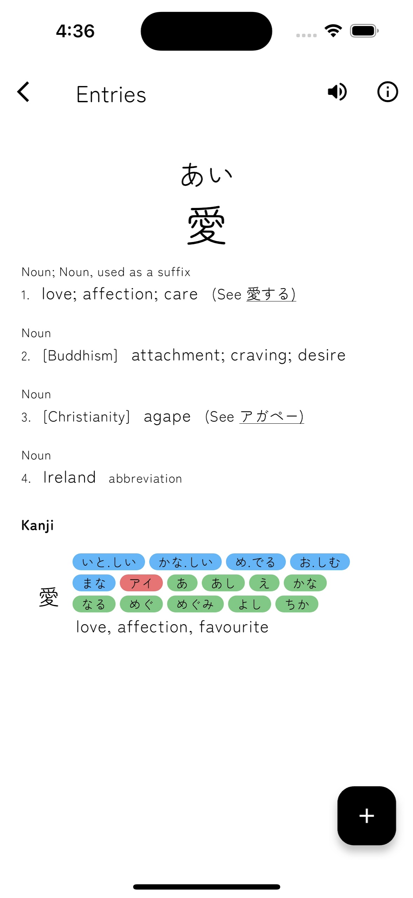
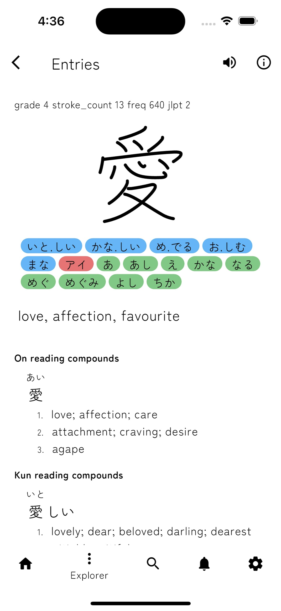

# Memo: Your vocab friend

Memo aims to help you learn japanese vocabulary. It handles lists on which you can do quiz and it uses spaced repetition to compute when a certain word should be studied again.

## Requirements
- [Flutter](https://docs.flutter.dev/get-started/install) for the frontend
- [Memo-dico-tools](https://github.com/ookiiwi/memo-dico-tools.git) for running the backend server

## Installation

```sh
$ git clone --recurse-submodules https://github.com/ookiiwi/Memorize.git
$ cd Memorize
$ dart pub get
$ flutter pub get
$ flutter run
```

## Gallery

<p align="center">
    
    
    
</p>


## External resources

- [Flutter](https://docs.flutter.dev/) is under the [BSD-3-Clause license](https://github.com/flutter/flutter/blob/master/LICENSE)
- [Dependencies licenses](/licenses.json)
